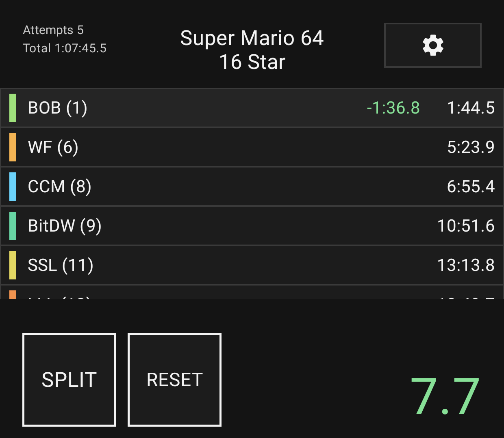
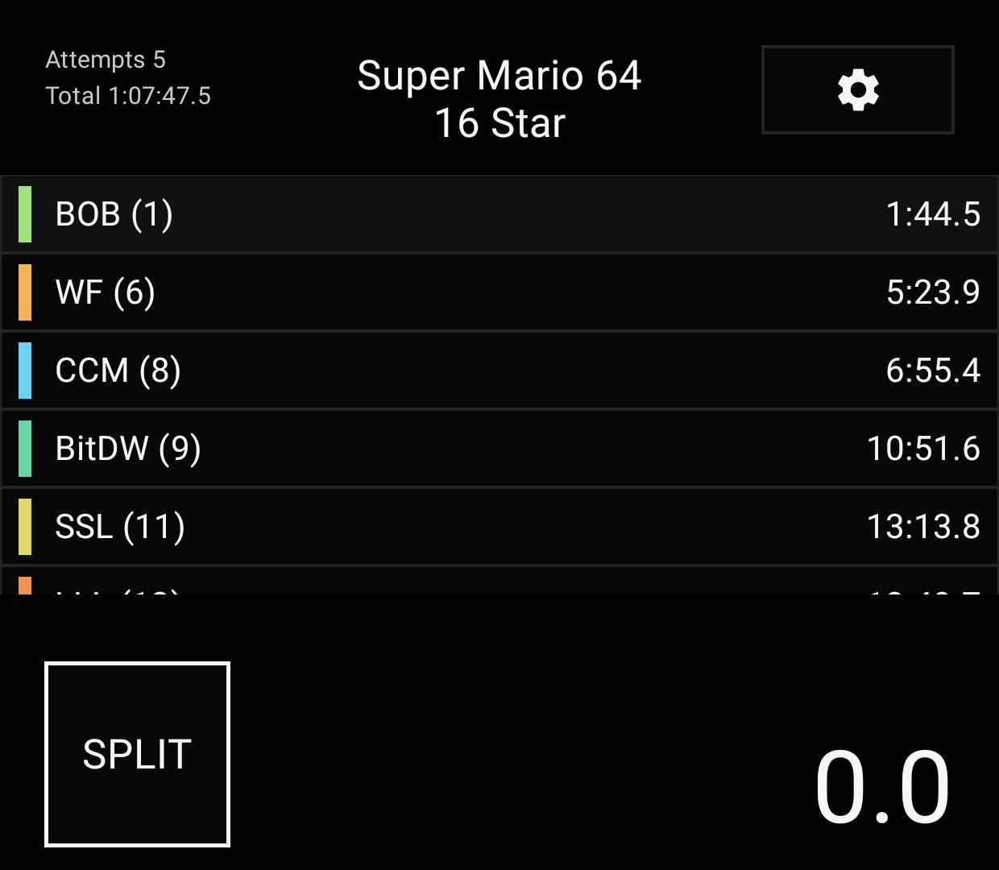
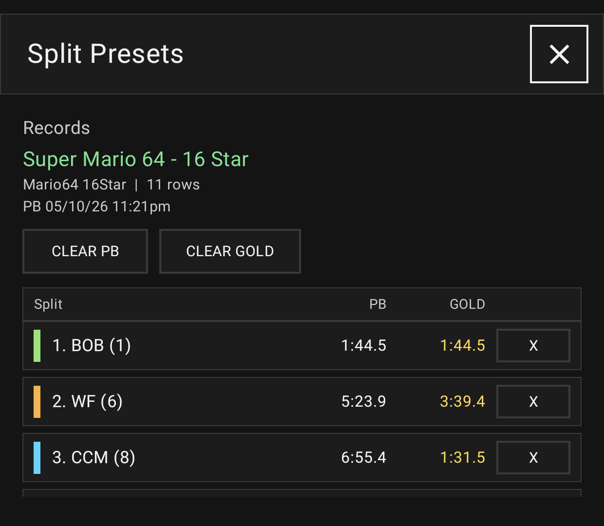
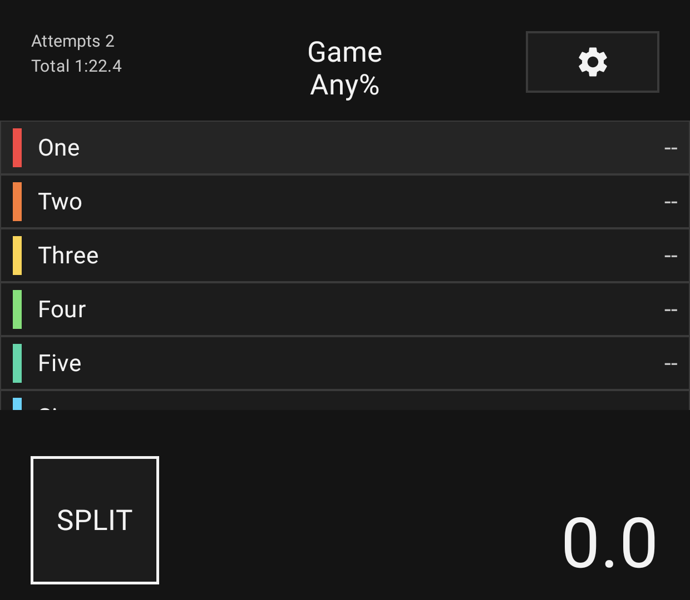

# Thor Speedrun Splits

Thor Speedrun Splits is a LiveSplit-inspired Android split timer designed for the AYN Thor bottom screen. It is built with Kotlin, Jetpack Compose, and Room.

The app is optimized for the Thor's 1080x1240 3.92 inch AMOLED bottom display, with large touch targets, an OLED-friendly layout, fullscreen system UI hiding, and a row structure suited for quick speedrun glances.

## Features

- LiveSplit-style split rows with split names, row colors, PB times, live deltas, and a large main timer.
- Manual run controls with large `SPLIT`, `RESET`, and `DONE` states.
- Scrollable split list that keeps the next split visible as the run advances.
- Custom split presets with editable game title, category, row names, row colors, row order, and row count.
- Persistent presets stored with Room.
- Persistent loaded preset selection across app restarts.
- Per-preset attempted run count and total time tracked in the top-left of the timer screen.
- Room-backed personal bests saved only when a run is completed.
- PB comparison deltas while running, including active-split green deltas after segment time loss and red count-up whenever behind PB.
- Best segment tracking per preset with gold split highlighting.
- Records tab for viewing PB split times, PB completion date/time, best segments, and clearing PB/gold data.
- Light, Dark, and OLED themes, plus an option to follow Android system light/dark mode.
- Font selection for Default, Pixel, Pixel Bold, Princess, Breathe, and Red Hat.
- Subtle button animations and hardware vibration feedback.
- Fullscreen immersive mode that hides Android status/navigation bars.
- AndroidX Material vector icons for settings, close, and row movement controls.

## Screenshots

<p>
  
  
</p>
<p>
  
  
</p>

## Requirements

- Android Studio
- JDK 11 or newer
- Android SDK configured for this project

## Getting Started

1. Clone the repository.
2. Open the project in Android Studio.
3. Let Gradle sync the project.
4. Run the `app` configuration on an emulator or Android device.

You can also build from the command line:

```sh
./gradlew assembleDebug
```

## License

This project is licensed under the MIT License. See [LICENSE](LICENSE) for details.
