# Thor Speedrun Splits

Thor Speedrun Splits is a LiveSplit-inspired Android split timer designed for the AYN Thor bottom screen. It is built with Kotlin, Jetpack Compose, and Room.

The app is optimized for the Thor's 1080x1240 3.92 inch AMOLED bottom display, with large touch targets, an OLED-friendly layout, fullscreen system UI hiding, and a row structure suited for quick speedrun glances.

If you would rather build the app yourself, instructions are below. If you just want to download and install, head to the releases page!

You can add it to <b>Obtainium</b> here:

<p align="center">
  <a href="http://apps.obtainium.imranr.dev/redirect.html?r=obtainium://add/https://github.com/JonJon2005/Thor-SpeedrunSplits">
    
  </a>
</p>


## Features

- LiveSplit-style timer with color-coded split rows, one-decimal formatting, PB comparisons, live ahead/behind deltas, golds/best segments, automatic active-row scrolling, and manual scroll-back.
- Large touch controls for starting, splitting, undoing, resetting, and finishing runs, with haptics, pressed states, and subtle animations; RESET requires a visible half-second hold by default to avoid accidental resets, with an optional quick-tap setting.
- Optional inverted bottom layout places timer and run stats on the left with the SPLIT, UNDO, and RESET controls on the right.
- Persistent PBs, Sum of Best, attempts, total run time, completed-run history, run details, PB dates, gold management, and largest segment gain/loss reporting.
- Custom Room-backed presets with editable game/category, split names, colors, order, and row count; load, create, edit, delete, reset, and compatible PB-preserving updates.
- Validated multi-preset `.thorbackup.json` export/import through Android's file picker, including definitions, PBs, golds, stats, and history with repeat-safe merging and conflict protection.
- Collapsible icon-based settings drawer with sticky section headers for Customization, Presets, Runs & Records, Recording, Backup & Data, and About.
- Light, Dark, and OLED themes, optional Android system-theme following, toggleable OLED screen shifting, and six font choices: Default, Pixel, Pixel Bold, Princess, Breathe, and Red Hat.
- Automatic GitHub release checks with an in-app `Update Now` link, About links, version display, and internal/external display status for dual-screen devices.
- Run recording of Android's internal/default display: starts with a run, keeps a three-second post-run tail, and saves an MP4 to app storage or a persistent custom folder using the preset game, category, run length, and date; optionally discard reset/abandoned-run recordings.
- Optional opposite-screen recording target and internal playback-audio capture (device playback, not microphone input), plus a flashing red recording indicator while capture is active.
- Independent recording controls for 240p, 480p, 720p, or 1080p resolution, 2–16 Mbps bitrate, and an enforced 30 or 60 FPS capture cap; settings apply directly at capture time.
- Immersive fullscreen layout optimized for the AYN Thor's 1080x1240 AMOLED display, with large targets, long-title handling, and dual-screen-aware display labeling.

## Screenshots

Home and settings drawer:
<p>
  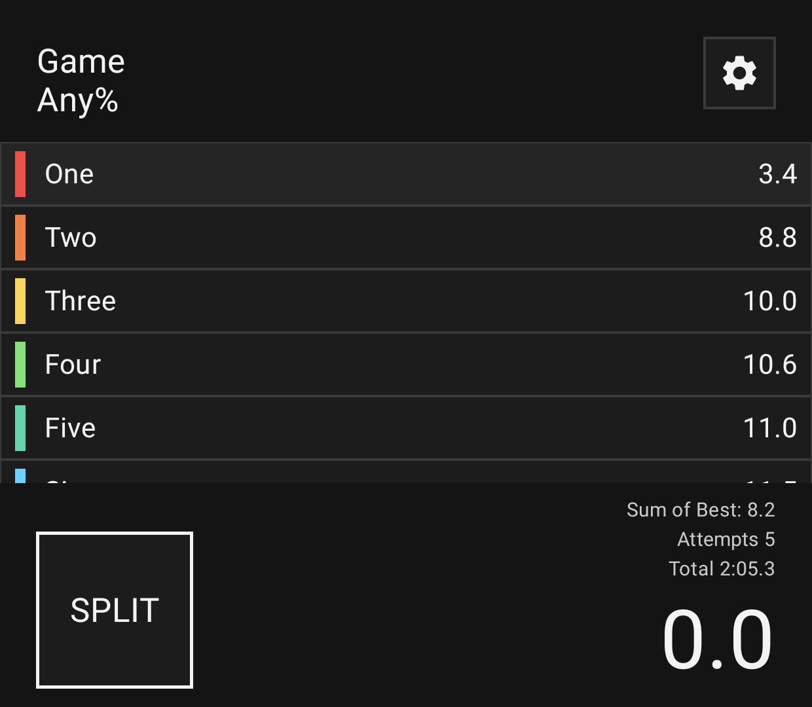
  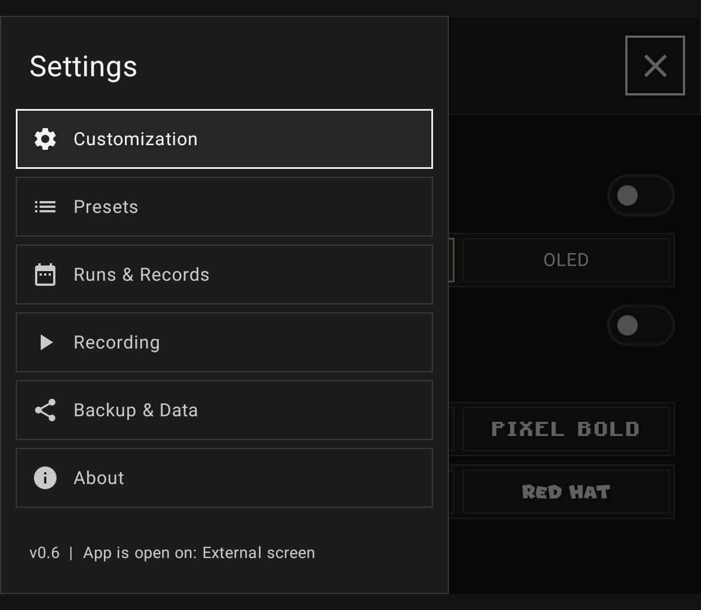
  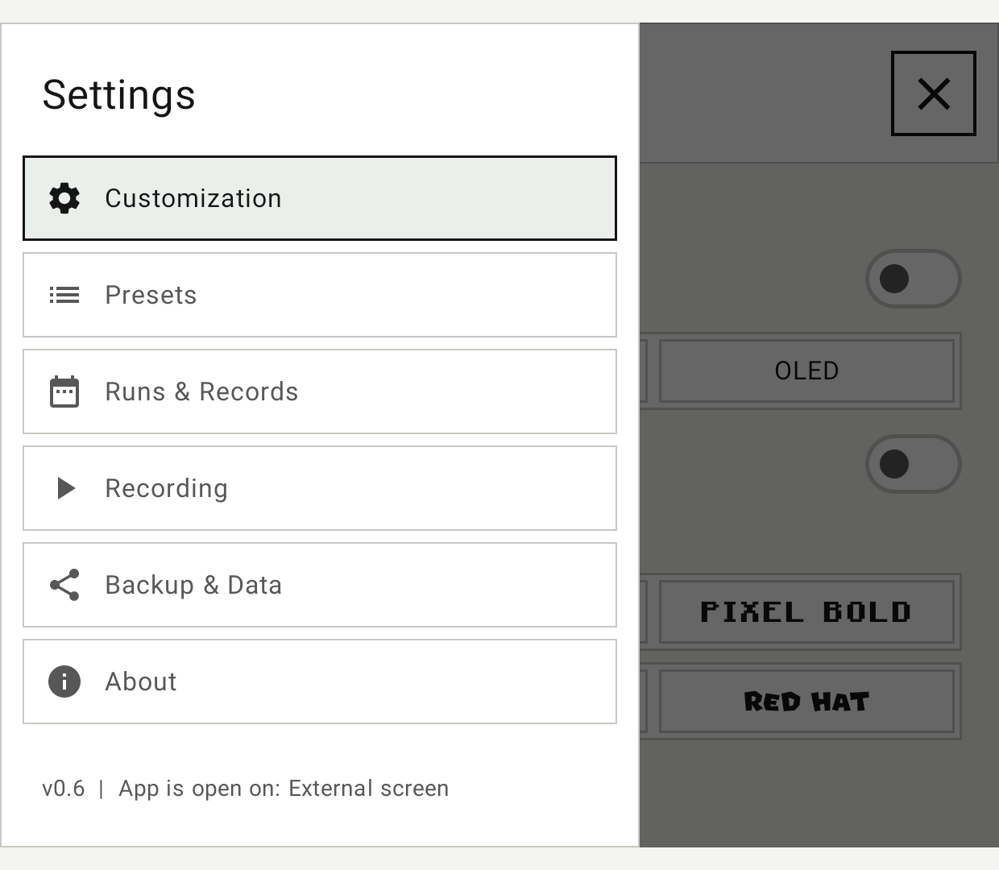
  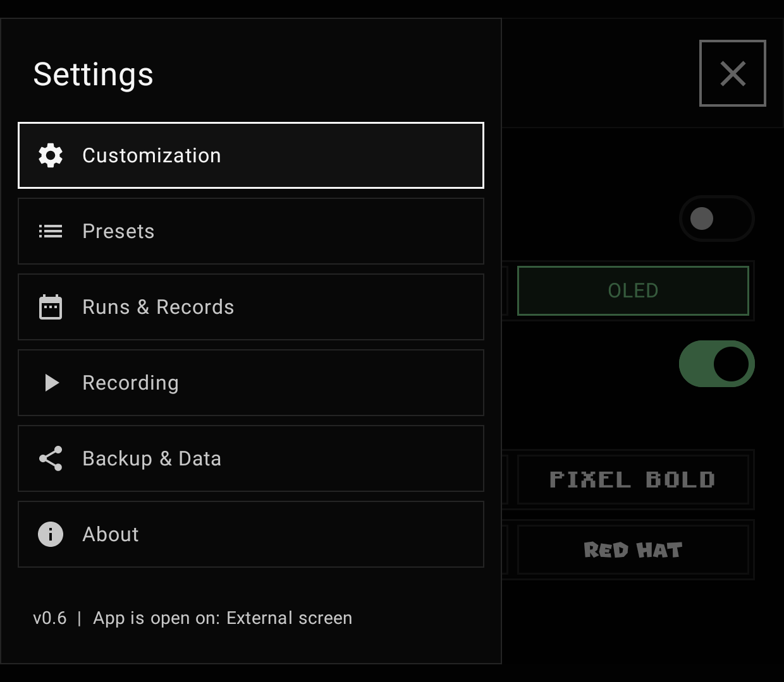
</p>

Settings sections:
<p>
  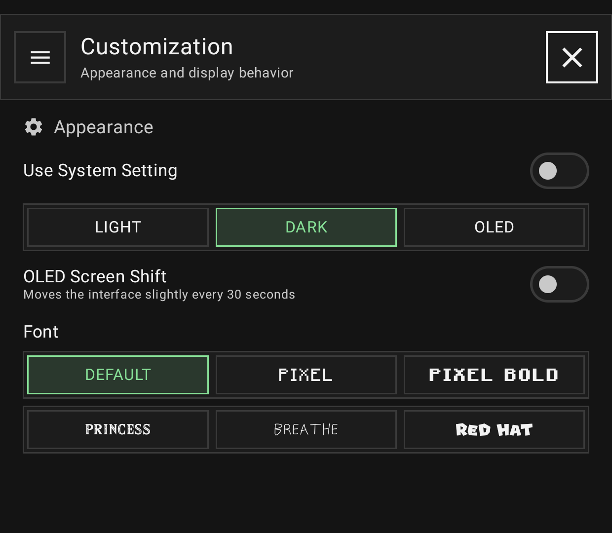
  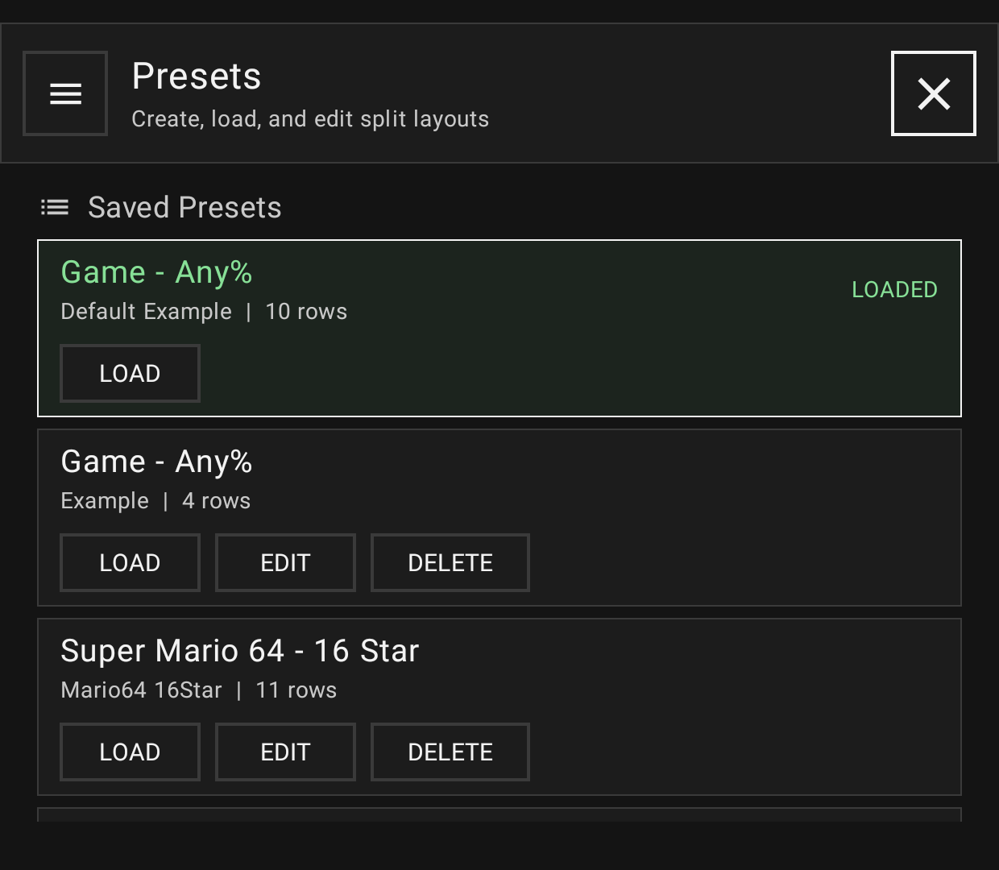
  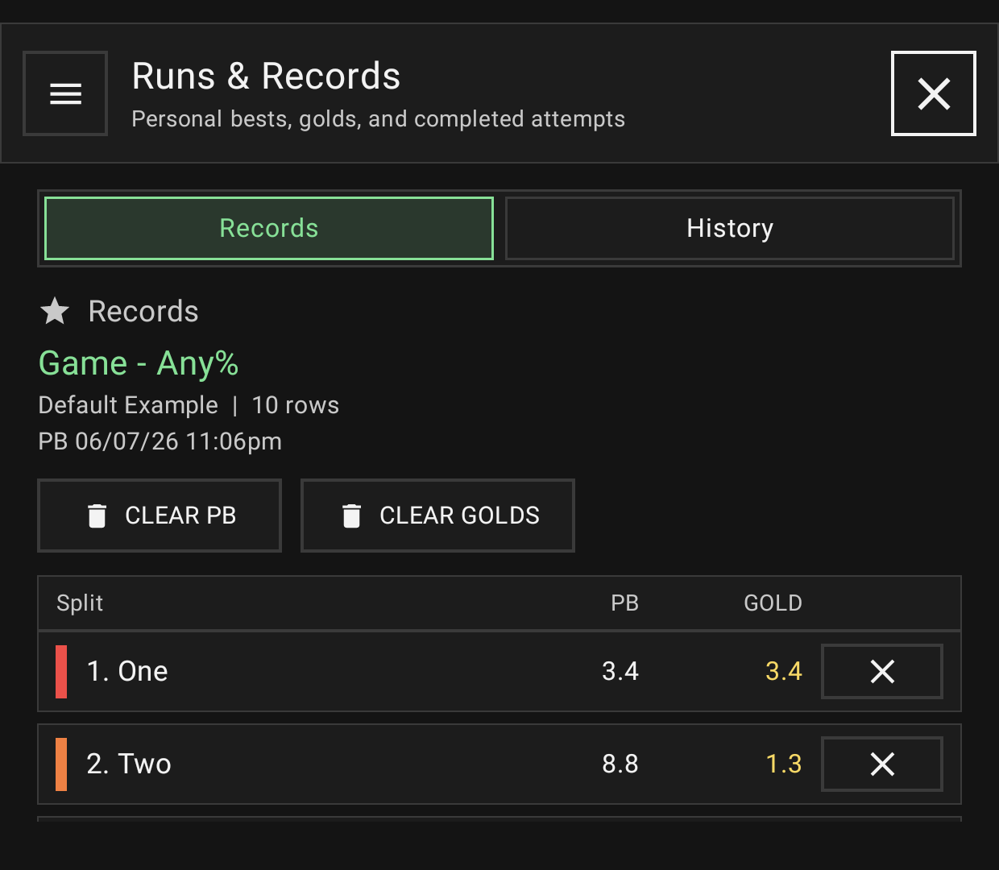
  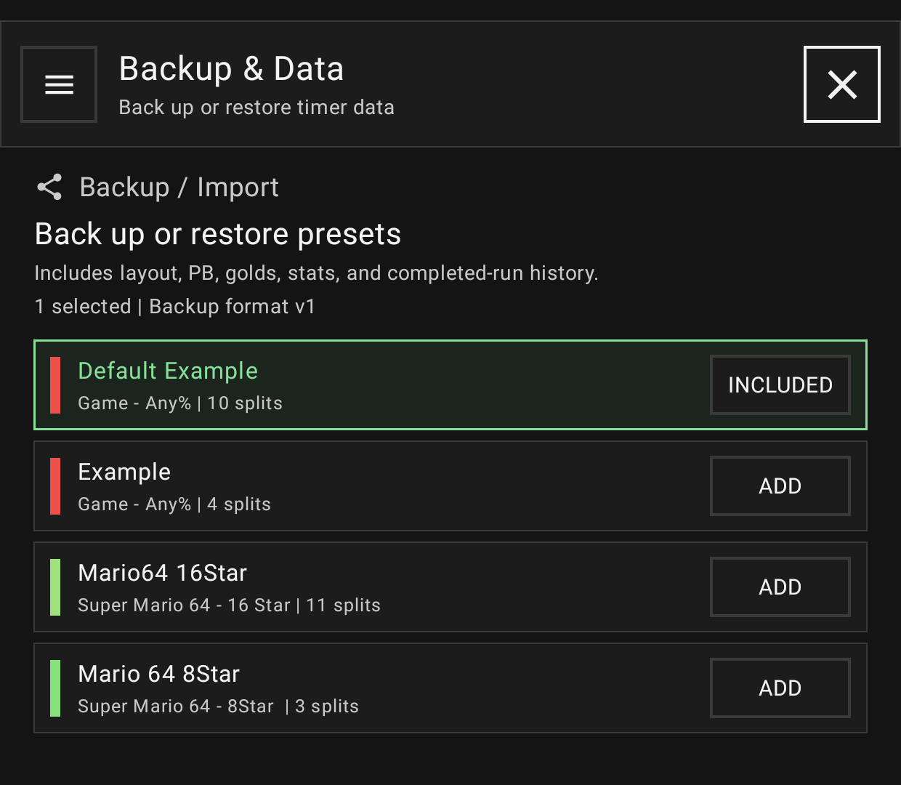
  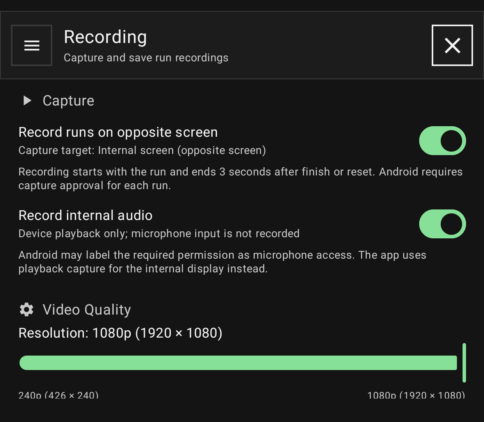
  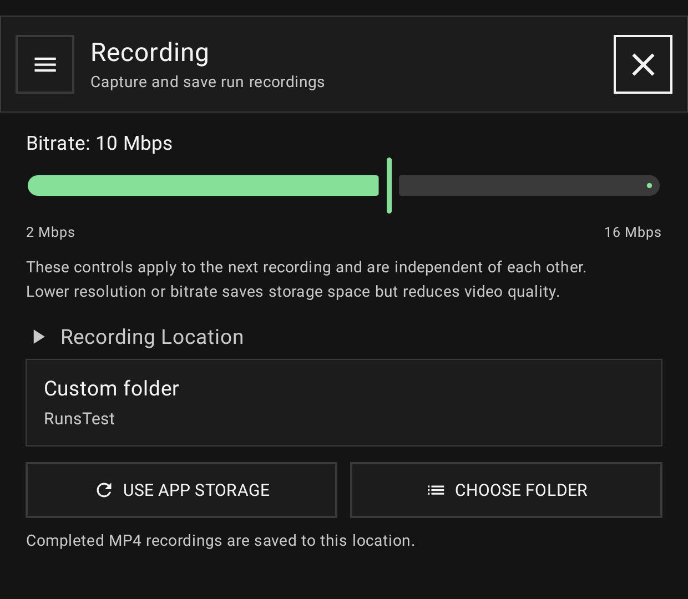
  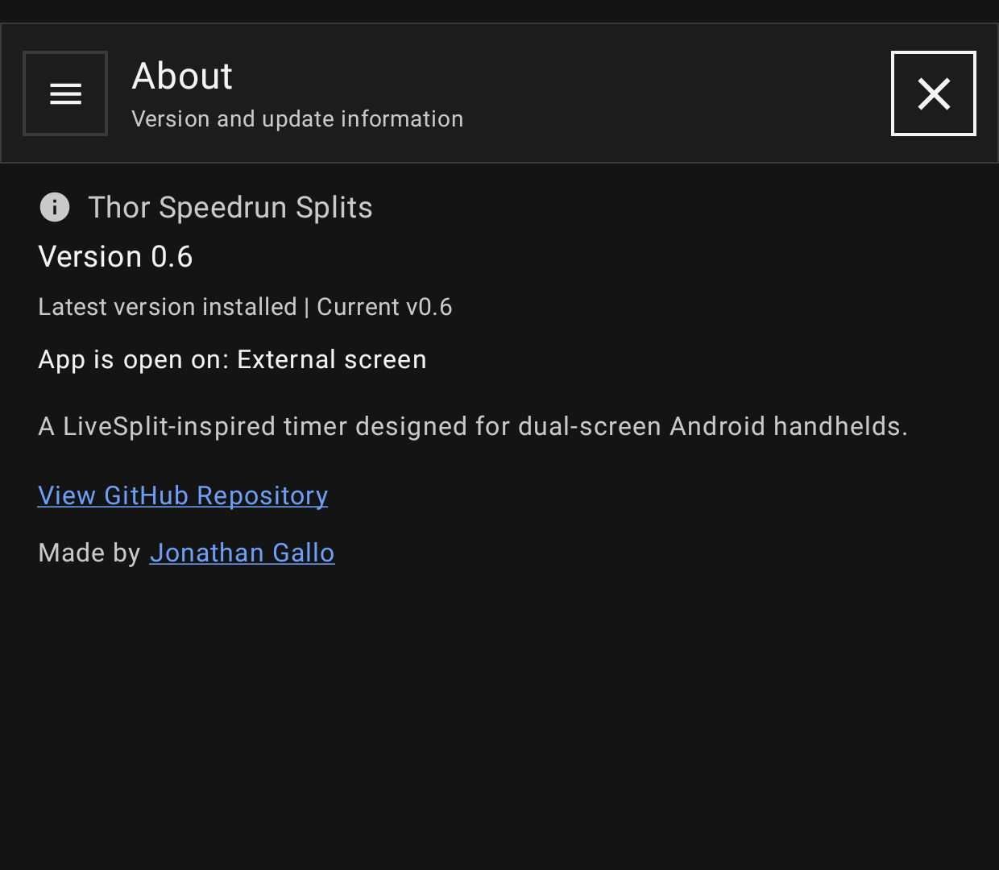
</p>

## Requirements to build app yourself (this project is open-source)

- Android Studio
- JDK 11 or newer
- Android SDK configured for this project

## Getting Started

1. Clone the repository.
2. Open the project in Android Studio.
3. Let Gradle sync the project.
4. Run the `app` configuration on an emulator or Android device.

You can also build from the command line:

```sh
./gradlew assembleDebug
```

## License

This project is licensed under the MIT License. See [LICENSE](LICENSE) for details.
