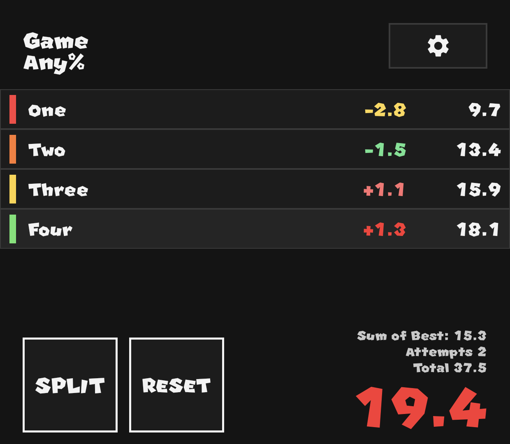
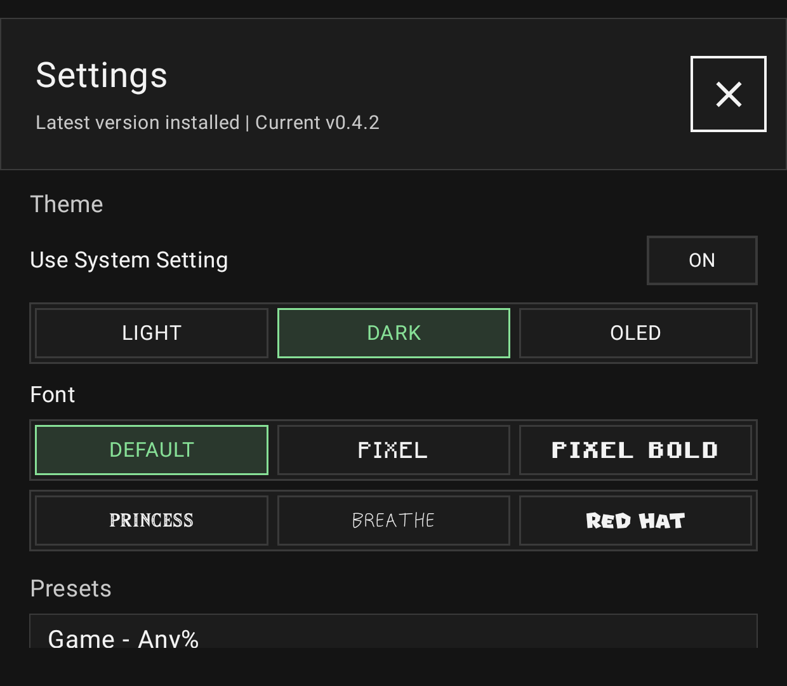
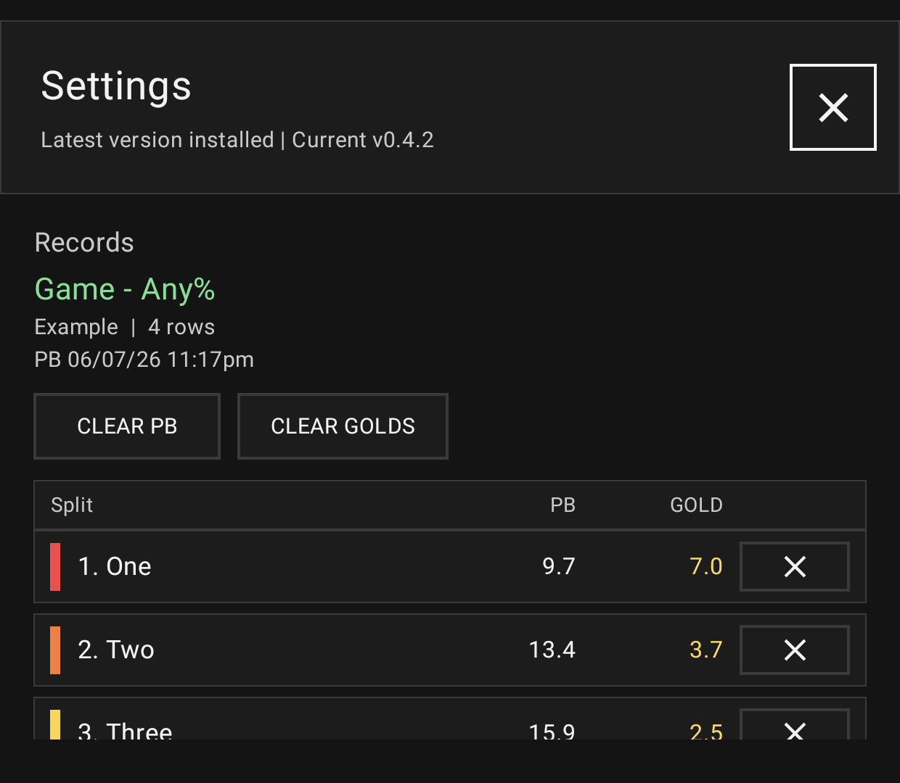
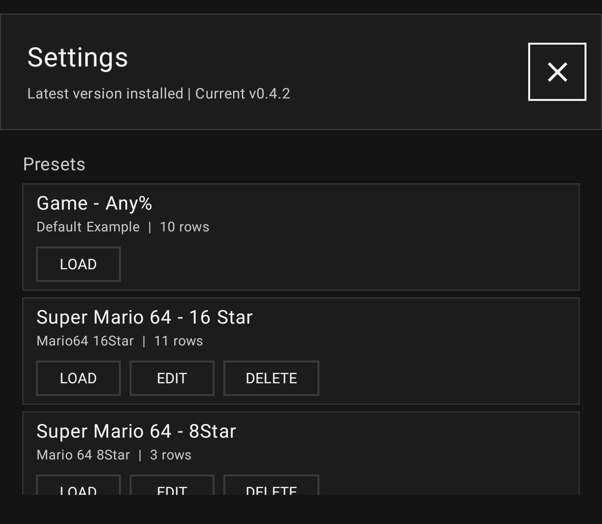
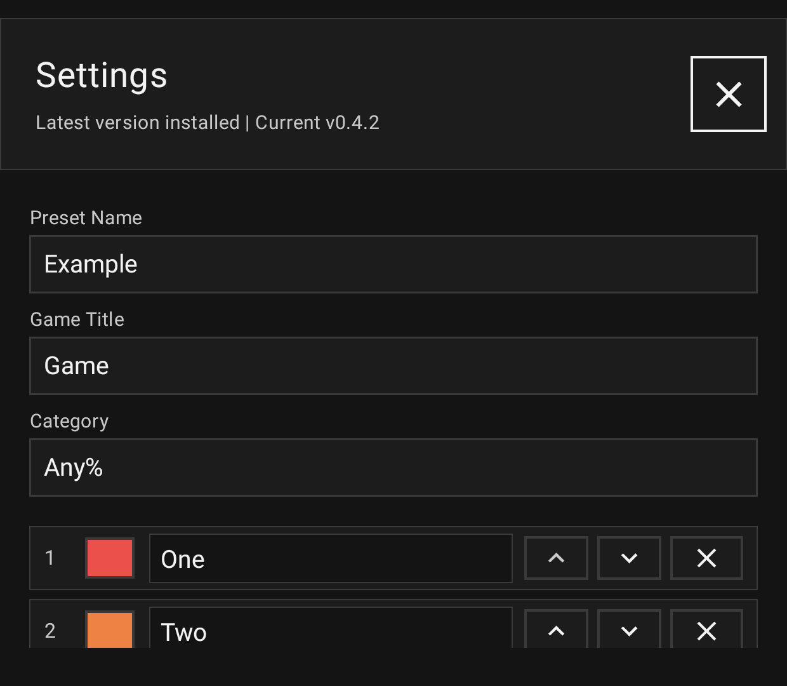
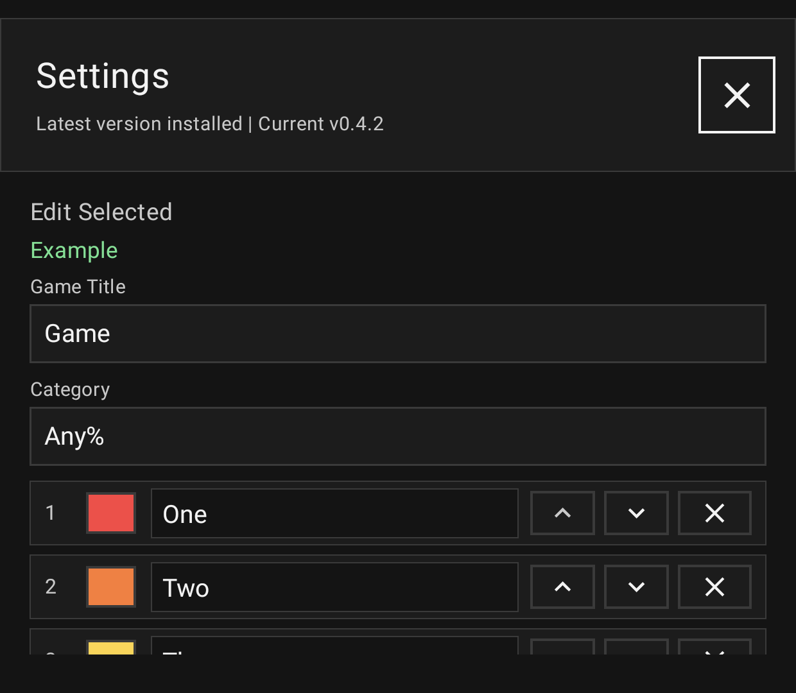
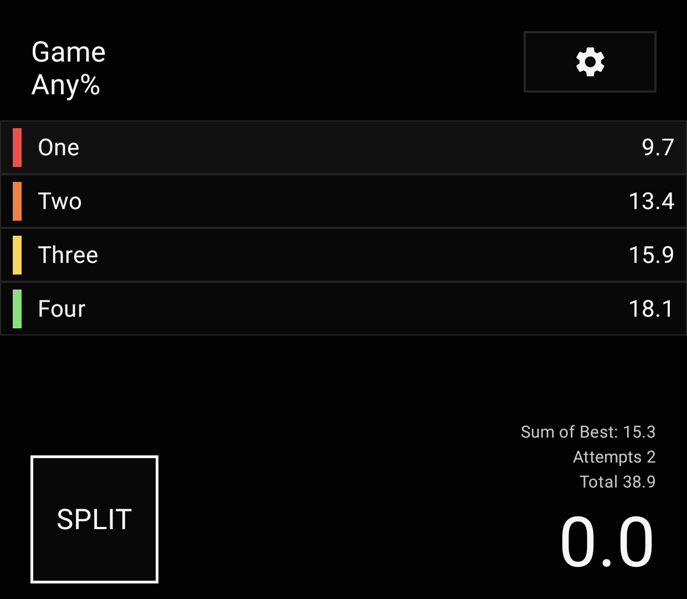
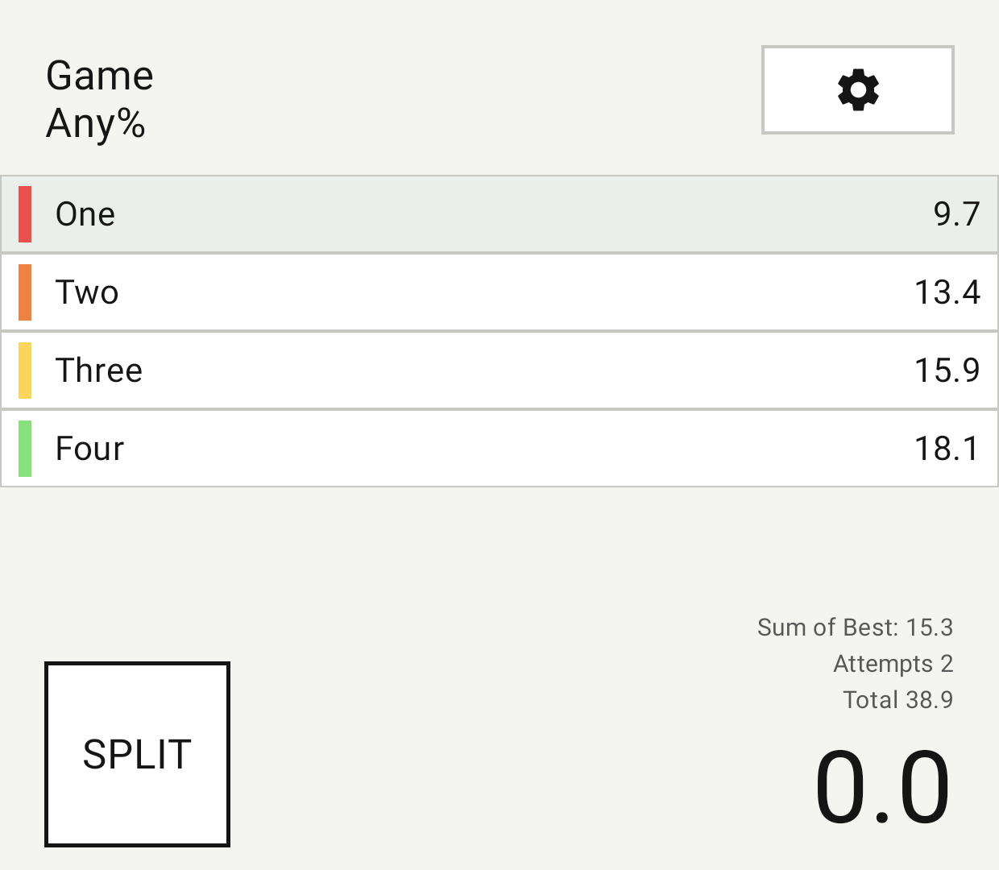

# Thor Speedrun Splits

Thor Speedrun Splits is a LiveSplit-inspired Android split timer designed for the AYN Thor bottom screen. It is built with Kotlin, Jetpack Compose, and Room.

The app is optimized for the Thor's 1080x1240 3.92 inch AMOLED bottom display, with large touch targets, an OLED-friendly layout, fullscreen system UI hiding, and a row structure suited for quick speedrun glances.

If you would rather build the app yourself, instructions are below. If you just want to download and install, head to the releases page!

You can add it to <b>Obtainium</b> here:

<p align="center">
  <a href="http://apps.obtainium.imranr.dev/redirect.html?r=obtainium://add/https://github.com/JonJon2005/Thor-SpeedrunSplits">
    
  </a>
</p>


## Features

- LiveSplit-style timer with color-coded rows, PB times, live ahead/behind deltas, automatic scrolling, and compact time formatting.
- Large touch controls for starting, splitting, undoing, resetting, and finishing runs, with vibration and subtle animations.
- Persistent personal bests, gold/best segments, Sum of Best, attempt count, and total run time for every preset.
- Completed-run history with saved game/category and split snapshots, comparison deltas, golds, and largest gain/loss details.
- Records tools to view PB completion time, inspect PB/gold splits, and clear individual golds, all golds, or the PB.
- Custom presets with editable names, game, category, split names, colors, order, and row count; presets can be loaded, edited, deleted, or reset to the built-in example.
- Compatible preset edits preserve mapped PB and best-segment data, while destructive deletes require confirmation.
- Room persistence for presets, records, history, statistics, preferences, and the last loaded preset.
- Multi-preset JSON backup and restore through Android's file picker, including records, stats, and history; imports are validated, repeat-safe, and merge without overwriting conflicting presets.
- Light, Dark, and OLED themes, optional Android system-theme following, toggleable OLED screen shifting, and six font choices: Default, Pixel, Pixel Bold, Princess, Breathe, and Red Hat.
- Automatic GitHub release checks with an in-app `Update Now` link when a newer version is available.
- Collapsible settings drawer for customization, presets, runs and records, backup and data, and app information, with a sticky section header.
- Automatic run recording of Android's internal/default display when enabled: capture starts with the timer, keeps a three-second post-run tail, and saves an MP4 to app storage or a persistent custom folder with the preset game, category, run length, and date in its filename. On dual-screen devices, true opposite-screen capture requires the timer app to run on the external display.
- Optional internal-display playback audio capture can be included in recordings; it captures device playback rather than microphone input and combines the audio with the MP4 after capture.
- Independent recording controls for common 240p, 480p, 720p, and 1080p resolutions and video bitrate (2–16 Mbps), applied directly during capture to control quality and file size; recordings use 60 FPS.
- A slow-flashing red recording indicator appears beside Settings while capture is active, including during the post-run tail.
- Immersive fullscreen layout designed for the AYN Thor's 1080x1240 bottom AMOLED display, with large touch targets and long-title handling.

## Screenshots

Settings and Records:
<p>
  
  
  
</p>

Managing Presets:
<p>
  
  
  
</p>

Themes:
<p>
  
  
</p>

## Requirements to build app yourself (this project is open-source)

- Android Studio
- JDK 11 or newer
- Android SDK configured for this project

## Getting Started

1. Clone the repository.
2. Open the project in Android Studio.
3. Let Gradle sync the project.
4. Run the `app` configuration on an emulator or Android device.

You can also build from the command line:

```sh
./gradlew assembleDebug
```

## License

This project is licensed under the MIT License. See [LICENSE](LICENSE) for details.
